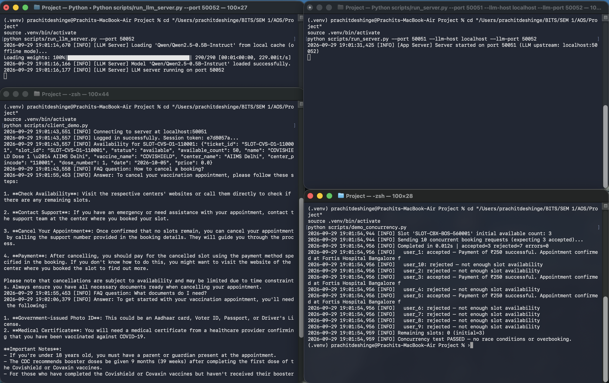
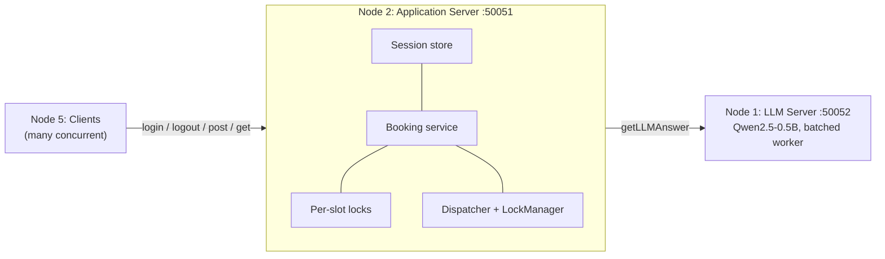
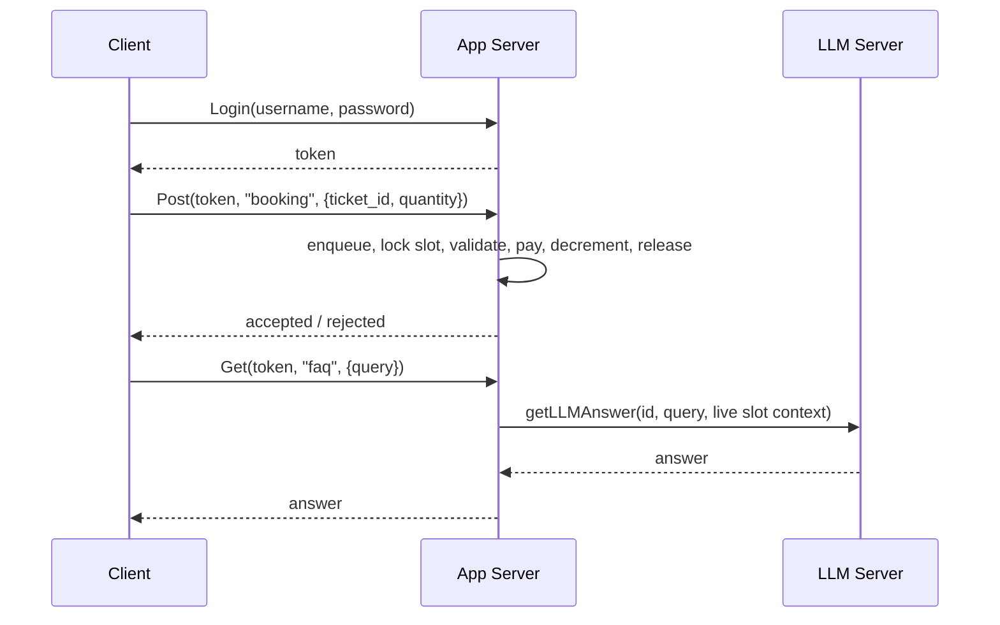

# Distributed Ticket Booking System

**CS G623 Advanced Operating Systems · BITS Pilani · Semester I 2026–27**
Architecture A (Distributed Ticket Booking), instantiated as a **vaccine-slot booking platform**.
**Status: Milestone 1 complete** · Milestone 2 (Raft consensus) planned.

A gRPC-based, multi-node booking system in Python. Clients compete for limited slots, the application server guarantees no overbooking under concurrency, and an FAQ assistant runs on a **separate LLM node** using a small offline model (`Qwen2.5-0.5B-Instruct`). All state is in memory in Milestone 1.



## Contents

[Milestone 1 checklist](#milestone-1-checklist) · [Architecture](#architecture) · [gRPC contract](#grpc-contract) · [Concurrency control](#concurrency-control) · [LLM integration](#llm-integration) · [Results](#results) · [Quick start](#quick-start) · [Testing](#testing) · [Project structure](#project-structure) · [Known limitations](#known-limitations) · [Milestone 2 roadmap](#milestone-2-roadmap)

## Milestone 1 checklist

| Deliverable (assignment) | Where it lives | Status |
|---|---|---|
| gRPC service definitions | `proto/ticket_service.proto` (3 services, 7 RPCs) | ✅ |
| Client–server communication | `grpc/service.py` (`TicketClientServicer`, `TicketClient`) | ✅ |
| Authentication & sessions | Token issued at `Login`, verified on `Post`/`Get`, deleted at `Logout` | ✅ (mock credentials) |
| Fundamental business logic | `business/booking_service.py`: inventory, mock payment, cancel | ✅ |
| Domain LLM on a separate server | `llm/domain_llm.py`, `scripts/run_llm_server.py` | ✅ |
| Project structure & setup | This README, `pyproject.toml`, `scripts/` | ✅ |

## Architecture



All inter-node communication is gRPC. The app server never loads the model; it calls `LLMService` on Node 1.

**Booking request lifecycle**



## gRPC contract

Messages are typed protobuf; request payloads are JSON strings so new request types need no schema change.

| Service | RPC | Assignment signature |
|---|---|---|
| `TicketClientService` | `Login` | `login(username, password)` → `loginResponse(status, token)` |
| | `Logout` | `logout(token)` → `status` |
| | `Post` | `post(token, type, data)` → `status` (`type`: `booking`, `cancel`) |
| | `Get` | `get(token, type, params)` → `getResponse(status, [(id, data)])` (`type`: `availability`, `faq`) |
| `TicketAppService` | `ProcessBusinessRequest` | `processBusinessRequest(requestId, payload, context)` |
| | `GetLLMAnswer` | forwards to the LLM node |
| `LLMService` | `GetLLMAnswer` | `getLLMAnswer(requestId, query, context)` → `getLLMAnswerResponse(requestId, answer)` |

To regenerate stubs after editing the proto: `bash scripts/generate_grpc.sh`.

## Concurrency control

A booking runs as: **enqueue in `Dispatcher` → acquire the slot's own lock → validate → mock payment → decrement and record → release**.

- **One `threading.Lock` per slot**, not a global lock. Different slots proceed in parallel; only contenders for the same slot are serialized.
- Cancellation restores inventory under the same slot lock.
- Availability reads take no lock (a single integer read).
- `Dispatcher` (FIFO queue, priority field carried) and `LockManager` (logical owner tracking) record request order and ownership for observability.

## LLM integration

- **Separate node**: `LLMService` on port 50052, reached over gRPC.
- **Domain-specific**: the system prompt encodes 8 booking rules (dose gaps, age eligibility, ID, cancellation window, fees) and forbids medical advice.
- **Context-aware**: when a query looks like an availability question, the app server injects live slot counts into the prompt.
- **CPU-friendly and offline**: weights load from the local Hugging Face cache (`local_files_only=True`), downloading only on first run.
- **Batched inference**: one worker thread owns the model and groups requests arriving within a 60 ms window into a single batched call.
- **Graceful fallback**: if the model cannot load, a keyword FAQ responder answers instead.

## Results

From the live run shown above (MacBook Air, CPU):

| Check | Result |
|---|---|
| 10 concurrent clients, slot with 3 available | 3 accepted, 7 rejected, 0 errors, remaining 0 (12 ms) |
| Overbooking | None (`Concurrency test PASSED`) |
| LLM FAQ latency | About 12 s per answer on CPU |
| Unit tests | 13 / 13 passing |
| gRPC integration tests | 2 / 2 passing |

Small models can drift from the prompt rules. In the demo run the cancellation answer did not cite the 24-hour rule, and the documents answer added a medical-certificate requirement that is not in the rules. See [Known limitations](#known-limitations).

## Quick start

**Requirements:** Python 3.10+ (about 1 GB free for the model on first run).

```bash
python3 -m venv .venv && source .venv/bin/activate   # Windows: .venv\Scripts\activate
pip install -e .
pip install torch transformers pytest                # LLM + tests
```

> Without `torch`/`transformers` the system still runs, but the LLM node silently uses the keyword fallback instead of Qwen.

**One command** (starts both servers, runs the client demo and the concurrency test):

```bash
python scripts/run_all_demo.py
```

**Manually** (one terminal each):

```bash
python scripts/run_llm_server.py --port 50052                                          # Node 1
python scripts/run_server.py --port 50051 --llm-host localhost --llm-port 50052        # Node 2
python scripts/client_demo.py                                                          # Node 5: single client walkthrough
python scripts/demo_concurrency.py localhost 50051 10                                  # Node 5: 10 clients race for 3 slots
```

## Testing

```bash
pytest tests/ -v
```

| File | Covers | Tests |
|---|---|---|
| `test_contracts.py` | Data models, `LockManager` | 4 |
| `test_business_and_grpc_contracts.py` | Booking logic, `Dispatcher`, LLM stub | 9 |
| `test_grpc_integration.py` | In-process gRPC servers, end-to-end booking, concurrency | 2 |

The integration tests start their own servers on random ports, so nothing needs to be running. They load `DomainLLM`, so the first run is slower if the model is not cached.

## Project structure

```
proto/ticket_service.proto            gRPC services and messages
src/dist_ticket_booking/
  business/booking_service.py         booking, cancellation, per-slot locks
  coordination/lock_manager.py        logical lock ownership queue
  scheduler/dispatcher.py             FIFO request queue
  core/models.py                      VaccineSlot, Appointment, ...
  grpc/service.py                     servicers + TicketClient wrapper
  grpc/ticket_service_pb2*.py         generated stubs
  llm/domain_llm.py                   offline Qwen, batched worker, fallback
  monitoring/, simulation/            logging and scenario helpers
scripts/                              run_server, run_llm_server, demos
tests/                                unit + integration tests
docs/                                 progress report, live-run screenshot
```

## Known limitations

- **Mock authentication**: any non-empty password is accepted.
- **In-memory state, single app server**: a crash loses all bookings; there is no replication yet.
- **`LockManager` is a single logical owner tracker** used for observability; correctness comes from the per-slot `threading.Lock`.
- **LLM quality**: a 0.5B model can contradict the rules in its prompt and takes seconds per answer on CPU. Candidate fixes are a stricter prompt, retrieval of the exact rule, or a larger model.
- **Insecure gRPC channels** (no TLS) and mock payments.

## Milestone 2 roadmap

Due 18 Nov 2026 (hard deadline 20 Nov).

| Requirement | Plan |
|---|---|
| Leader election, failure detection | `requestVote` / `requestVoteReply` between app nodes |
| Log replication | `appendEntries` / `appendEntriesReply` carrying booking commands |
| Strong consistency | A booking commits only after a majority acknowledges it |
| Demo topology | LLM node, Raft leader, two followers, multiple clients |
| Fault tolerance | Kill the leader mid-run; a new leader is elected and no booking is lost |

Reference: Ongaro & Ousterhout, *In Search of an Understandable Consensus Algorithm (Extended Version)*.
